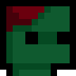
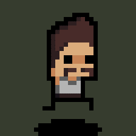
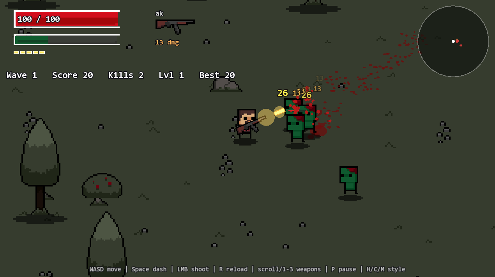
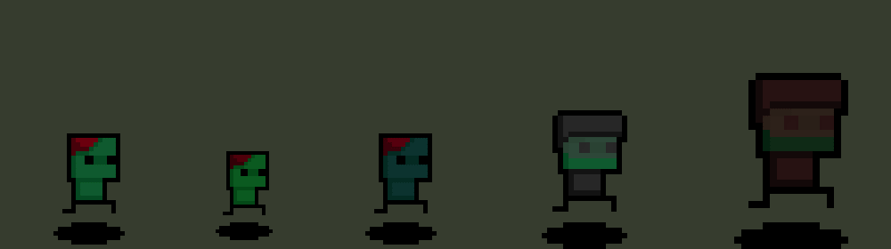
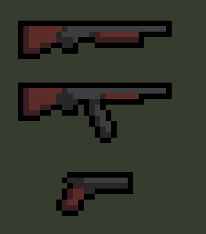
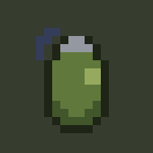
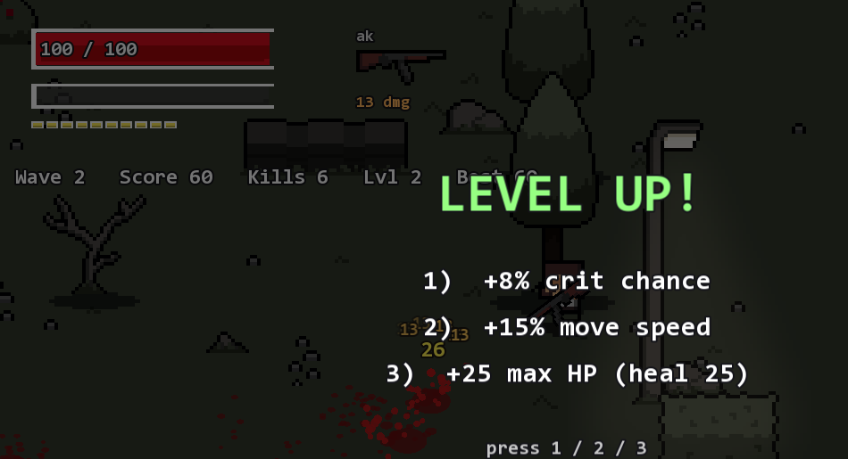
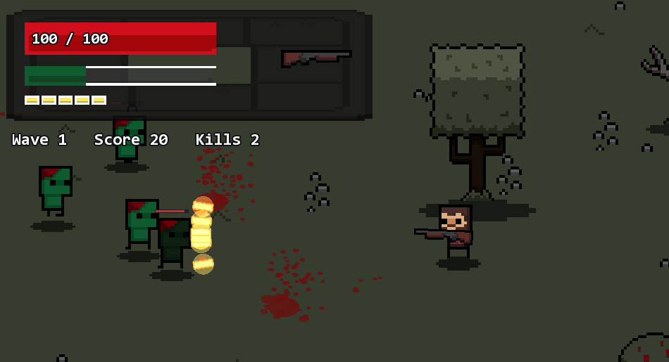

<div align="center">



# N E K R O N

**One survivor. An endless map. The dead never stop coming.**




*A fast, bloody, pixel-art bullet heaven.*



</div>

---

## THE HORDE

<div align="center">


*Walker &nbsp;&middot;&nbsp; Runner &nbsp;&middot;&nbsp; Spitter &nbsp;&middot;&nbsp; Tank &nbsp;&middot;&nbsp; Boss*
</div>

| Enemy | HP | Behavior |
|-------|:--:|----------|
| **Walker** | 100+ | relentless, hits harder every wave |
| **Runner** | 50+ | fast — closes the gap before you can reload |
| **Spitter** | 70+ | keeps its distance and spits venom projectiles |
| **Tank** | 220+ | armored — shrugs off part of every bullet |
| **Boss** | 500+ | arrives every 5th wave; below half HP it enrages: faster, double damage |

Every wave the horde grows in number, health, speed and damage. Past wave 15 the bosses come in pairs. There is no ceiling — only a best score.

## ARSENAL

<table align="center">
<tr>
<td align="center"></td>
<td align="center"></td>
</tr>
<tr>
<td align="center"><em>Shotgun, AK, Pistol</em></td>
<td align="center"><em>Grenade</em></td>
</tr>
</table>

| Weapon | Fire mode | Damage | Mag | Evolution — earned after boss waves |
|--------|-----------|:------:|:---:|--------------------------------------|
| **AK** | full-auto, 10 rps | 13 | 30 | fires two bullets per shot |
| **Shotgun** | one blast per click | 7 x 11 | 6 | twelve pellets per blast |
| **Pistol** | semi-auto | 25 | 12 | piercing rounds, +50% damage |
| **Grenade** | thrown, max 3 | 110 AoE | — | knockback, scorch marks, screen shake |

Every bullet can crit for double damage. Kills freeze the game for a few milliseconds; boss kills freeze it hard. You will feel each shot.

## CONTROLS

| Key | Action |
|:---:|--------|
| `W A S D` | move |
| `mouse` | aim — the weapon tracks your cursor |
| `LMB` | shoot |
| `Space` | dash with invincibility frames |
| `G` | throw grenade toward the cursor |
| `R` | reload |
| `scroll` / `1 2 3` / `Q` | switch weapons |
| `P` / `Esc` | pause / pause menu |
| `F11` | fullscreen |
| `H` `C` `M` | hair, shirt, moustache |

## PROGRESSION

<div align="center">
 
</div>

- Kills grant XP. The green bar fills, you level up, the game pauses: pick one of three upgrades — damage, speed, max HP, reload, fire rate, crit chance.
- Clear a boss wave and choose a **weapon evolution**.
- The dead drop ammo, medkits, grenades and coins — pulled toward you by magnet when you actually need them.
- A day/night cycle rolls over the map; at night, the street lamps earn their keep.
- Your best score survives between runs.

## GET THE GAME

Download `Nekron-win64.zip` from [**Releases**](../../releases), unzip, run `Nekron.exe`. No installer, no dependencies, 2 MB.

## BUILD FROM SOURCE

```sh
cmake -S . -B build-sfml -DUSE_SFML=ON -DCMAKE_BUILD_TYPE=Release
cmake --build build-sfml -j 8
./build-sfml/Nekron
```

SFML 2.6.2 is fetched and compiled automatically. All you need is CMake 3.26+ and a C++23 compiler.

<details>
<summary>Console demo build (no SFML — used by CI)</summary>

```sh
cmake -S . -B build -DCMAKE_BUILD_TYPE=Debug
cmake --build build -j 8
./build/oop
```

Exercises the game-logic classes directly in a console scenario. Sanitizers via `-DUSE_ASAN=ON`, Valgrind via `./scripts/run_valgrind.sh`.
</details>

## UNDER THE HOOD

- **Model / view split** — the rules (`Game`, `Player`, the `Zombie` hierarchy, `Weapon`, `EntityPool<T>`) never touch a pixel; the SFML layer (`GameApp`, `WorldRenderer`, `Hud`, `CharacterSprite`) drives them through their public interface.
- **Infinite deterministic world** — terrain streams in hashed chunks: same seed, same forest, zero storage.
- **Layered character** — body, shirt, hair, moustache and shadow are separate sprites composited every frame. The GIFs on this page are built from the same sheets.
- **Fully procedural audio** — every gunshot, explosion, and the soundtrack loop are synthesized from math at startup. Drop an `assets/music.ogg` next to the exe to override the music.
- **Zero-asset effects** — blood decals, floating damage numbers, hit-stop, screen shake, crit flashes, low-HP vignette, dynamic zoom, minimap, day/night: all drawn from primitives.
- Virtual hierarchies with `dynamic_cast`, factory and singleton patterns, a custom exception hierarchy doing real control flow (running out of ammo literally throws), templates, copy-and-swap, STL throughout.

## LICENSE

Code under [AGPLv3](LICENSE), based on the [oop-template](https://github.com/mcmarius/oop-template) ([Unlicense](LICENSE.template)). Built with [SFML](https://www.sfml-dev.org/). Pixel-art sprite pack included in `assets/`; the grenade sprite, all sounds and the music are original to this project.
